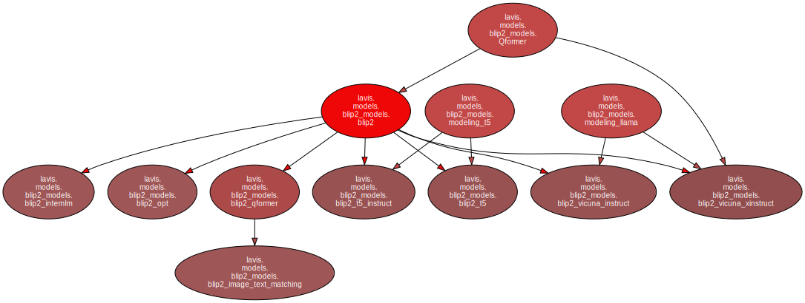

# 使用InternLM2 1.8B模型微调BLIP2

为了给后续工作打好基础，先学习下BLIP2模型，用InternLM2结合BLIP2模型做个中文版的Image Captioning。

**为什么不直接用InternVL或者InternLM-XComposer这些模型做微调？**

BLIP2发表于23年初，后续的很多视觉语言模型（VLM）架构都参考了BLIP2，所以先从BLIP2开始折腾，有助于对底层原理深入理解。

## BLIP2代码分析

BLIP2并不是一个单独的项目，而是在Salesforce AI研究团队开发的多模态语言视觉智能库（[LAVIS](https://github.com/salesforce/LAVIS)）中的一个项目。理解BLIP2的代码，并且修改BLIP2模型，需要先对LAVIS做个了解。

### LAVIS项目概览

LAVIS的关键模块如下图所示：


现在几乎每个大公司都有一套自己的库，把Pytorch做个封装，搞一套自己的Config体系，再开发一套Runner。各个项目代码相对独立，每个项目内的网络结构在各自的项目内实现。熟悉了一套之后，其他的也都大同小异。

下面看看代码目录结构。LAVIS并不是按照项目完全独立的组织代码，而是把每个项目的模型，配置，执行脚本等分别组织到统一的目录下，我们要找一个项目的相关文件，需要到好几个不同的目录下。而且配置文件和代码也不是分开放的，这就带来更多不方便。

```
.
├── app
│   ├── calculate_coco_features.py
│   ├── caption.py
│   ├── classification.py
│   ├── dataset_browser.py
│   ├── image_text_match.py
│   ├── __init__.py
│   ├── main.py
│   ├── multimodal_search.py
│   ├── multipage.py
│   ├── text_localization.py
│   ├── utils.py
│   └── vqa.py
├── assets
│   └── demo-6.png
├── CODE_OF_CONDUCT.md
├── CODEOWNERS
├── dataset_card
│   ├── avsd_dialogue.md
│   ├── coco_caption.md
│   ├── coco_retrieval.md
│   ├── conceptual_captions.md
│   ├── didemo_retrieval.md
│   ├── flickr_retrieval.md
│   ├── gqa.md
│   ├── imgs
│   ├── msrvtt_qa.md
│   ├── msrvtt_retrieval.md
│   ├── msvd_qa.md
│   ├── nlvr2.md
│   ├── nocaps.md
│   ├── sbu_caption.md
│   ├── snli_visual_entailment.md
│   └── vqav2.md
├── docs
│   ├── benchmark.rst
│   ├── build_docs.sh
│   ├── conf.py
│   ├── getting_started.rst
│   ├── index.rst
│   ├── intro.rst
│   ├── make.bat
│   ├── Makefile
│   ├── requirements.txt
│   ├── _static
│   ├── tutorial.configs.rst
│   ├── tutorial.datasets.rst
│   ├── tutorial.evaluation.rst
│   ├── tutorial.models.rst
│   ├── tutorial.processors.rst
│   ├── tutorial.rst
│   ├── tutorial.tasks.rst
│   └── tutorial.training-example.rst
├── evaluate.py
├── examples
│   ├── albef_feature_extraction.ipynb
│   ├── albef_vqa.ipynb
│   ├── albef_zero_shot_classification.ipynb
│   ├── blip2_feature_extraction.ipynb
│   ├── blip2_image_text_matching.ipynb
│   ├── blip2_instructed_generation.ipynb
│   ├── blip_feature_extraction.ipynb
│   ├── blip_image_captioning.ipynb
│   ├── blip_image_text_matching.ipynb
│   ├── blip_text_localization.ipynb
│   ├── blip_vqa.ipynb
│   ├── blip_zero_shot_classification.ipynb
│   ├── clip_feature_extraction.ipynb
│   └── clip_zero_shot_classification.ipynb
├── lavis                    # lavis的主要目录
│   ├── common
│   ├── configs              # 这里是模型和数据集的配置参数，yaml格式，这个目录下面有个default.yaml，里面可以修改缓存路径，这个路径是用来保存下载的数据集
│   ├── datasets             # 数据集相关代码，包括数据集下载脚本
│   ├── __init__.py
│   ├── models               # 模型实现代码
│   ├── output               # 训练或者评估的输出结果目录
│   ├── processors
│   ├── projects             # 这里的项目目录，保存的是各个项目训练和评估的配置参数，yaml格式
│   ├── __pycache__
│   ├── runners
│   └── tasks
├── LICENSE.txt
├── MANIFEST.in
├── projects                 # 这个项目目录其实是项目文档目录，基本上就是README
│   ├── blip2
│   ├── blip-diffusion
│   ├── img2llm-vqa
│   ├── img2prompt-vqa
│   ├── instructblip
│   ├── pnp-vqa
│   └── xinstructblip
├── pyproject.toml
├── README.md
├── requirements.txt
├── run_scripts              # 这里面是各个项目的执行脚本
│   ├── albef
│   ├── alpro
│   ├── blip
│   ├── blip2
│   ├── blip-diffusion
│   ├── clip
│   ├── gpt
│   ├── pnp-vqa
│   ├── run_browser.sh
│   └── run_demo.sh
├── salesforce_lavis.egg-info
│   ├── dependency_links.txt
│   ├── not-zip-safe
│   ├── PKG-INFO
│   ├── requires.txt
│   ├── SOURCES.txt
│   └── top_level.txt
├── SECURITY.md
├── setup.py
├── tests
│   └── models
└── train.py

38 directories, 79 files
```

### BLIP2模型实现

关于BLIP2的模型分析，网上很多了，这里贴一个[比较详细解读的文章](https://zhuanlan.zhihu.com/p/664011842)。

### BLIP2推理

### BLIP2训练

我手上最大的单机算力是一个双卡4090服务器，就用这个服务器跑了一下预训练的两个阶段。

可能是BLIP2模型发布的比较早，LAVIS代码在之后经历了多次更新，导致在不修改代码的前提下无法正常跑起训练。最大的问题是数据集加载，coco数据集的有个字段`image_id`，形式是`coco_123456`这种字符串形式，但是在`blip2_qformer.py:160`这里需要将`image_id`转成`tensor`。所以这里将代码改成：

```
- image_ids = samples["image_id"].view(-1,1)
+ image_ids = torch.tensor([int(x.split('_')[1]) for x in samples["image_id"]]).view(-1, 1).to(image.device)
```

这样修改之后，coco数据集可以正常加载了。但是另一个vg数据集仍然有问题，不知道是不是下载数据集的代码更新了，下载下来的数据集目录结构，和vg的`DataLoader`需要的图片路径不一样，这里我没有过多纠结，反正有一个coco数据集可以跑了，我就直接把vg数据集注释掉了。

另外需要修改的是`batch_size`，4090显存只有24GB，所以将`lavis/projects/blip2/train/pretrain_stage1.yaml`中的`batch_size_train`改为60，`lavis/projects/blip2/train/pretrain_stage1.yaml`中的`batch_size_train`改为`32`。同时`lavis/projects/blip2/train/pretrain_stage1.yaml`中的`pretrained`字段需要改成本地生成的checkpoint路径，我这里是`lavis/output/BLIP2/Pretrain_stage1/20240407164/checkpoint_9.pth`。

Pretrain_stage1 log:

```
{"train_lr": "0.000", "train_loss": "5.786", "train_loss_itc": "1.618", "train_loss_itm": "0.426", "train_loss_lm": "3.743"}
{"train_lr": "0.000", "train_loss": "4.650", "train_loss_itc": "1.163", "train_loss_itm": "0.288", "train_loss_lm": "3.199"}
{"train_lr": "0.000", "train_loss": "4.409", "train_loss_itc": "1.100", "train_loss_itm": "0.245", "train_loss_lm": "3.063"}
{"train_lr": "0.000", "train_loss": "4.252", "train_loss_itc": "1.061", "train_loss_itm": "0.219", "train_loss_lm": "2.972"}
{"train_lr": "0.000", "train_loss": "4.126", "train_loss_itc": "1.032", "train_loss_itm": "0.199", "train_loss_lm": "2.896"}
{"train_lr": "0.000", "train_loss": "4.014", "train_loss_itc": "1.006", "train_loss_itm": "0.183", "train_loss_lm": "2.825"}
{"train_lr": "0.000", "train_loss": "3.910", "train_loss_itc": "0.984", "train_loss_itm": "0.167", "train_loss_lm": "2.759"}
{"train_lr": "0.000", "train_loss": "3.819", "train_loss_itc": "0.966", "train_loss_itm": "0.154", "train_loss_lm": "2.700"}
{"train_lr": "0.000", "train_loss": "3.748", "train_loss_itc": "0.952", "train_loss_itm": "0.144", "train_loss_lm": "2.653"}
{"train_lr": "0.000", "train_loss": "3.696", "train_loss_itc": "0.942", "train_loss_itm": "0.136", "train_loss_lm": "2.618"}
```

Pretrain_stage2 log:

```
{"train_lr": "0.000", "train_loss": "2.109"}
{"train_lr": "0.000", "train_loss": "1.826"}
{"train_lr": "0.000", "train_loss": "1.773"}
{"train_lr": "0.000", "train_loss": "1.738"}
{"train_lr": "0.000", "train_loss": "1.709"}
{"train_lr": "0.000", "train_loss": "1.685"}
{"train_lr": "0.000", "train_loss": "1.659"}
{"train_lr": "0.000", "train_loss": "1.634"}
{"train_lr": "0.000", "train_loss": "1.615"}
{"train_lr": "0.000", "train_loss": "1.601"}
```

### 动手改模型

我们的目标是基于LAVIS中的BLIP2模型，替换其中的LLM模型，重新微调一个新的模型出来。根据LAVIS的[教程](https://opensource.salesforce.com/LAVIS//latest/tutorial.models.html)，要添加新的模型，需要引入完整的LAVIS库，然后继承它的`BaseMode`添加新的模型。这种扩展方式的主要问题在于，代码库里耦合了很多其他模型的代码，可能带来一些未知问题，调试的时候这些无关代码也容易产生干扰。在各种框架里面，MMLab的框架解耦做的最好，它把runner和config部分提取出来做成一个独立的库，MMEngine，不同模型开发只需要引入这个比较轻量的库就可以。

首先，看一下blip2_models目录下各个文件的调用关系。



从图中可以看的出来，BLIP2算法的基础在于`Qformer`，基于`QFormer`构建了`blip2`核心模型，其他模型都是从这个核心模型衍生出来的。单看这个模型的模块化设计，非常简洁清晰，同时也很方便我们就这个框架去扩展。注意看，第三排最左边的，就是我添加的`blip2_internlm`模型。

这个模型是从`blip2_opt`改写过来，因为`InternLM2`模型基本还是遵循LLaMa架构，和`OPT`师出同门，所以几乎可以平替。

`blip2_opt.py:85`:

```
        self.opt_tokenizer = AutoTokenizer.from_pretrained(opt_model, use_fast=False)
        self.opt_model = OPTForCausalLM.from_pretrained(
            opt_model, torch_dtype=torch.float16
        )
```

改为`blip2_internlm.py:82`:

```
        self.internlm_tokenizer = AutoTokenizer.from_pretrained(internlm_model, use_fast=False, trust_remote_code=True)
        self.internlm_model = AutoModelForCausalLM.from_pretrained(
            internlm_model, torch_dtype=torch.float16, trust_remote_code=True
        )
```

需要注意，这里用了`AutoModelForCausalLM`类自动加载模型架构，所以用的是internlm2的huggingface仓库。InternLM的官方GitHub仓库里没找到InternLM2的模型定义文件。

InternLM2模型接口和OPT模型接口几乎一样，所以大部分代码只需要把`opt_xxx`替换成`internlm_xxx`就可以了。除了一个地方：

`blip2_opt.py:149`:

```
        inputs_embeds = self.opt_model.model.decoder.embed_tokens(opt_tokens.input_ids)
```

这里对应的InternLM代码是：

```
        inputs_embeds = self.internlm_model.model.tok_embeddings(internlm_tokens.input_ids)
```

至此，改造完成，跑起来看看吧。

### 训练结果

这里主要跑的是二阶段训练，贴一下训练日志：

```
{"train_lr": "0.000", "train_loss": "2.530"}
{"train_lr": "0.000", "train_loss": "2.240"}
{"train_lr": "0.000", "train_loss": "2.181"}
{"train_lr": "0.000", "train_loss": "2.135"}
{"train_lr": "0.000", "train_loss": "2.095"}
{"train_lr": "0.000", "train_loss": "2.058"}
{"train_lr": "0.000", "train_loss": "2.022"}
{"train_lr": "0.000", "train_loss": "1.988"}
{"train_lr": "0.000", "train_loss": "1.959"}
{"train_lr": "0.000", "train_loss": "1.938"}
```

对比一下用OPT模型的二阶段训练日志：

```
{"train_lr": "0.000", "train_loss": "2.109"}
{"train_lr": "0.000", "train_loss": "1.826"}
{"train_lr": "0.000", "train_loss": "1.773"}
{"train_lr": "0.000", "train_loss": "1.738"}
{"train_lr": "0.000", "train_loss": "1.709"}
{"train_lr": "0.000", "train_loss": "1.685"}
{"train_lr": "0.000", "train_loss": "1.659"}
{"train_lr": "0.000", "train_loss": "1.634"}
{"train_lr": "0.000", "train_loss": "1.615"}
{"train_lr": "0.000", "train_loss": "1.601"}
```

OPT模型的loss明显要低一些，这个也可以理解，毕竟InternLM2我们用的是1.8B的权重，等我有了A100，再试试7B的效果。